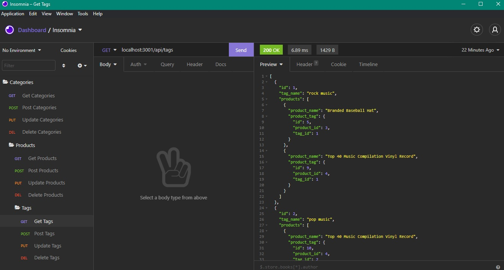

  # Ecommerce-BackEnd 
  ## Description 
  An app that's a Backend for an E-commerce business.
  ## Tables of Contents
  * [Installation](#installation)
  * [Usage](#usage)
  * [License](#license)
  * [Questions](#questions)
  
  ## Installation 
  * Git clone
  * [Npm I](https://www.npmjs.com/) In the Terminal/gitBash

  ## Usage
  * Node server.js In the Terminal/gitBash

  [Video Demo](https://drive.google.com/file/d/1OtoxSjr1lmL_sWw-9jqu8H0laKQcFKaI/view)

  
  
  ## Credits
  Stackedoverflow.com

  ## Questions
  For any questions please reach out to 
  github: [Ayotai](https://github.com/Ayotai)
  email: taimujarin@gmail.com
  ## License 
  ### Apache-2.0
  
A permissive license whose main conditions require preservation of copyright and license notices. Contributors provide an express grant of patent rights. Licensed works, modifications, and larger works may be distributed under different terms and without source code.
